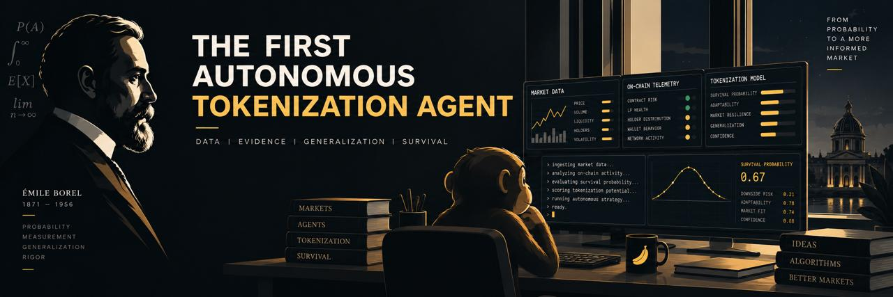

# Émile — Autonomous Robinhood Chain Token Survival Platform

> **Émile** is an autonomous machine learning agent that observes every Robinhood Chain token launched that crosses **$10,000 peak market cap**, and learns which of them go on to reach **$30,000 peak market cap**. He publishes everything he learns, live, on a public web dashboard.

[](https://github.com/Emile-Mon/Emile)
[](https://x.com/emilelearns?s=11)

He does **not** launch a token of his own until his model's proven performance floor clears **ROC-AUC 0.60**. That threshold is enforced strictly by mathematical bounds in code, not by a calendar. The jar on the dashboard is the visual representation of that gate.

---

## ⚠️ What Émile Is & What He Is Not

### What Émile Is
* A conditional probability estimator answering: *"Given a token already reached $10K peak market cap, what is the probability it reaches $30K peak market cap?"*
* A 100% transparent, open-data research platform publishing raw labeled CSV datasets (`/api/dataset.csv`) and machine-readable methodology specs (`/api/methodology.json`).
* An automated pipeline enforcing Vapnik–Chervonenkis (VC) capacity bounds and Bootstrap resample percentile limits.

### What Émile Is Not
* Émile **does not predict price**.
* Émile **does not have an edge that guarantees returns**. Four features cannot forecast a market.
* The jar **is not decorative**. If the model is bad or sample size is thin, the jar stays empty and the site explicitly names the failing gate (`blocked_by`).

---

## 🛠️ Architecture & Tech Stack

```
┌─────────────────────────────────────────────────────────────────────────┐
│                           EXTERNAL DATA SOURCES                         │
│  ┌──────────────────────┐  ┌─────────────────────┐  ┌────────────────┐  │
│  │ pump.fun Mint Source │  │ DexScreener API     │  │ Solana RPC     │  │
│  │ (Bitquery/Helius)    │  │ (Market Cap Poller) │  │ (Helius DAS)   │  │
│  └──────────┬───────────┘  └──────────┬──────────┘  └───────┬────────┘  │
└─────────────┼─────────────────────────┼─────────────────────┼───────────┘
              │                         │                     │
┌─────────────▼─────────────────────────▼─────────────────────▼───────────┐
│                            WORKER LAYER (Python 3.11)                   │
│  ┌──────────────────┐ ┌──────────────────┐ ┌──────────────────────┐    │
│  │ Ingest Worker    │ │ Label Worker      │ │ Lore Safety Worker    │    │
│  │ (every 60s)      │ │ (every 15m)       │ │ (on ingest)          │    │
│  └──────────┬───────┘ └──────────┬────────┘ └───────────┬───────────┘    │
│             │                    │                       │               │
│             │         ┌──────────▼────────┐              │               │
│             │         │ ML Training Job   │              │               │
│             │         │ (every 1h)        │              │               │
│             │         └──────────┬────────┘              │               │
└─────────────┼────────────────────┼───────────────────────┼───────────────┘
              │                    │                       │
              ▼                    ▼                       ▼
┌─────────────────────────────────────────────────────────────────────────┐
│                     DATA & EVENT BUS LAYER                              │
│  ┌─────────────────────────────────────┐  ┌──────────────────────────┐  │
│  │ PostgreSQL 15+                      │  │ Redis 7.x (Pub/Sub)      │  │
│  │ (Tokens, Daily Universe, Model Runs)│  │ (Live Event Streaming)   │  │
│  └─────────────────────────────────────┘  └────────────┬─────────────┘  │
└────────────────────────────────────────────────────────┼────────────────┘
                                                         │
┌────────────────────────────────────────────────────────▼────────────────┐
│                         API LAYER (FastAPI)                             │
│  ┌───────────────────────────────────────────────────────────────────┐  │
│  │ REST (/api/state, /api/dataset.csv, /api/methodology.json, ...)  │  │
│  │ WebSocket Server (wss://.../stream)                               │  │
│  └──────────────────────────────────┬────────────────────────────────┘  │
└─────────────────────────────────────┼───────────────────────────────────┘
                                      │
┌─────────────────────────────────────▼───────────────────────────────────┐
│                       FRONTEND LAYER (Next.js 14 / PWA)                 │
│  ┌──────────────────────────┐ ┌──────────────────┐ ┌─────────────────┐ │
│  │ Émile Hero Scene (Video) │ │ CRT Live Screen  │ │ Proof Panel     │ │
│  │ + Live Video Feed        │ │ (lore sanitized) │ │ (sliders & gates│ │
│  └──────────────────────────┘ └──────────────────┘ └─────────────────┘ │
└─────────────────────────────────────────────────────────────────────────┘
```

| Layer | Technology | Function |
|---|---|---|
| **Backend** | Python 3.11 + FastAPI | Async ASGI server, REST endpoints & WebSocket broadcaster. |
| **ML Engine** | `LightGBM`, `scikit-learn`, `sentence-transformers` | 5-Fold Stratified CV, MiniLM-L6-v2 embedding -> PCA 24 dims. |
| **Database** | PostgreSQL 15+ + SQLAlchemy 2.0 Async | Concurrent writes for ingest & label workers, DDL with stored generated UTC hours. |
| **Cache & Bus** | Redis 7.x | Pub/Sub realtime event streaming & hourly CSV dataset caching. |
| **Frontend** | Next.js 14 (App Router) + Zustand | Glassmorphic CRT dashboard, rAF event batching, interactive math sliders. |

---

## 🧮 Machine Learning & Jar Math Formulations

### 1. Feature Families (4 Families, Capacity $d = 28$)
1. `launch_hour`: $\sin$ / $\cos$ encoding of UTC hour-of-day (2 columns).
2. `launch_dow`: One-hot encoded day-of-week (7 columns).
3. `holders`: $\log(1 + \text{holders})$ sampled ONCE at 48-hour mark via Solana RPC.
4. `lore`: Text embedding (`sentence-transformers/all-MiniLM-L6-v2`) reduced via PCA to 24 dimensions + `lore_len` + `lore_missing` + `name_tokens`.

### 2. Proven Performance Floor Formula
$$\text{proven}_{\text{floor}} = \min(\text{floor}_{\text{VC}}, \text{floor}_{\text{boot}})$$

Where:
* **VC Capacity Penalty**:
  $$\epsilon_{\text{VC}} = \sqrt{\frac{d(\ln(2n/d) + 1) + \ln(4/\delta)}{n}}$$
  $$\text{floor}_{\text{VC}} = \text{AUC}_{\text{mean}} - \epsilon_{\text{VC}}$$
* **Bootstrap Lower Bound**:
  $$\text{floor}_{\text{boot}} = \text{Percentile}_{2.5}(\text{Bootstrap}_{\text{AUCs}})$$
* **Jar Level**:
  $$\text{jar}_{\text{level}} = \text{clamp}\left(\frac{\text{proven}_{\text{floor}} - 0.50}{0.60 - 0.50}, 0.0, 1.0\right)$$

### 3. Hard Gates Verification
All 4 gates must pass to allow `jar_level` to reach `1.0`. If any gate fails, `jar_level` is capped at `0.95` and `blocked_by` publishes the failing gate name:
* `n_samples >= 2000`
* `n_positive >= 200`
* `auc_std < 0.05`
* `time_split_gap <= 0.04` (sanity check against temporal data leakage)

---

## 📂 Repository Structure

```
Emile/
├── backend/
│   ├── app/
│   │   ├── api/               # REST Endpoints (/api/state, /api/dataset.csv, /api/methodology.json) & WebSocket
│   │   ├── core/              # Config & environment settings
│   │   ├── db/                # Database connection & SQLAlchemy models
│   │   ├── ml/                # Feature extraction, LightGBM training, VC & Bootstrap math
│   │   ├── services/          # Ingest, DexScreener batch poller, Lore safety, Holder sampler
│   │   └── workers/           # Background scheduler loops
│   ├── tests/                 # Test suite (test_lore_safety, test_jar_math, test_leakage)
│   ├── DDL.sql                # PostgreSQL 15+ database schema
│   ├── main.py                # ASGI application entrypoint
│   └── requirements.txt       # Python dependencies
├── frontend/
│   ├── public/
│   │   └── videos/            # Monkey_typing_on_keyboard.mp4 live video asset
│   ├── src/
│   │   ├── app/               # Next.js App Router pages (/, /console, /about)
│   │   ├── components/        # HeroScene, CrtTerminal, ProofPanel, StatsStrip, HeaderBar, FooterBar
│   │   ├── store/             # Zustand state store with rAF batching & background tab drop
│   │   └── styles/            # CSS Design System tokens & CRT scanline effects
│   ├── next.config.ts         # Next.js configuration
│   └── package.json           # Frontend dependencies
├── EMILE-developer-brief.md   # Original project specification brief
├── README.md                  # System documentation
├── almost-surely-home.html    # Prototype landing page reference
└── survival-console.html      # Prototype research console reference
```

---

## 🚀 Getting Started

### Prerequisites
* **Python**: 3.10 or 3.11
* **Node.js**: v18+ (npm or pnpm)
* **PostgreSQL**: 15+
* **Redis**: 7.x

### 1. Database Initialization
```bash
# Create PostgreSQL database
createdb emile_db

# Execute DDL schema migration
psql -d emile_db -f backend/DDL.sql
```

### 2. Backend Setup (FastAPI & ML Engine)
```bash
cd backend

# Create virtual environment
python -m venv venv
source venv/bin/activate  # On Windows: venv\Scripts\activate

# Install dependencies
pip install -r requirements.txt

# Run Unit Tests (8/8 PASS)
python -m unittest discover tests

# Start FastAPI Server
uvicorn app.main:app --reload --host 0.0.0.0 --port 8000
```
* **Swagger API Documentation**: `http://localhost:8000/docs`

### 3. Frontend Setup (Next.js 14)
```bash
cd frontend

# Install dependencies
npm install

# Build & Run Production Server
npm run build
npm run start
```
* **Web Application**: `http://localhost:3000`

---

## 🔌 API Contract Overview

| Method | Endpoint | Description |
|---|---|---|
| `GET` | `/api/state` | Full snapshot: latest 100 tokens, counters, latest model run. |
| `GET` | `/api/model/history?days=30` | Model run history for AUC-over-time chart. |
| `GET` | `/api/methodology.json` | Machine-readable methodology specification. |
| `GET` | `/api/dataset.csv` | **Public downloadable labeled dataset CSV.** |
| `WS` | `wss://.../stream` | Realtime event stream (`token`, `counters`, `model`, `code`). |

---

## 📜 Name Origin & Homage

Émile is named in tribute to **Émile Borel** (1871–1956), the French mathematician who formulated the **Infinite Monkey Theorem**: a monkey hitting keys at random for long enough will, *almost surely*, type the works of Shakespeare.

pump.fun is the room full of typewriters. Émile is the one monkey who decided to sit down and record the results in a notebook.

---

## 📄 License & Disclaimer

* **Disclaimer**: Émile is a research mascot and machine learning experiment, not a financial adviser. Four features cannot forecast a market. This platform measures survival probabilities, not price targets.
